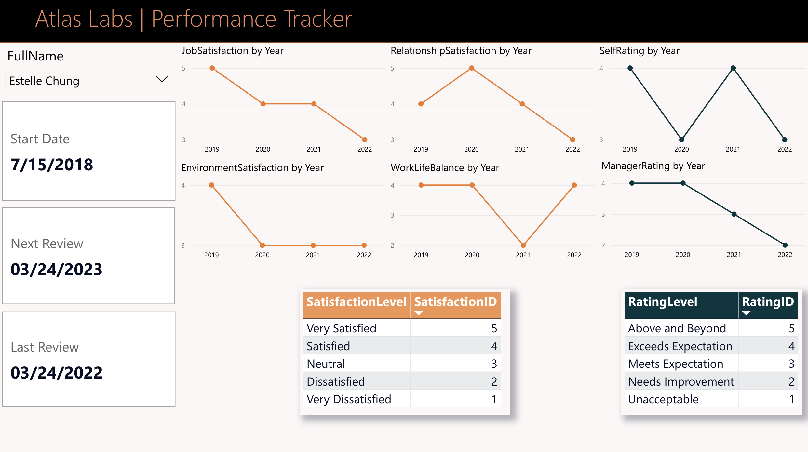
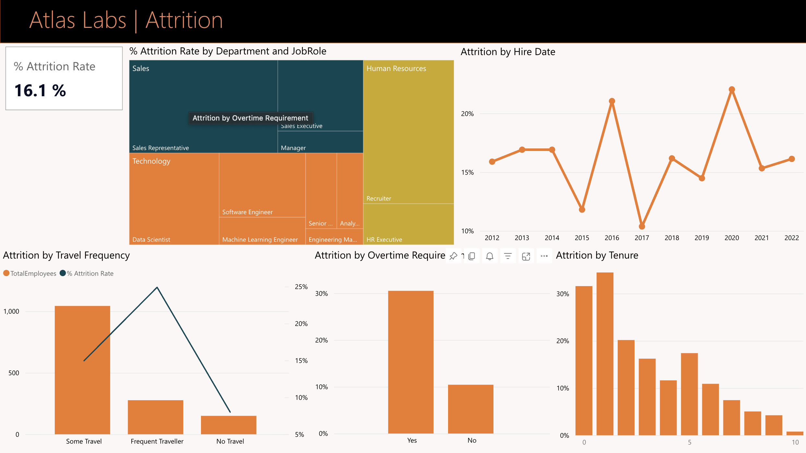
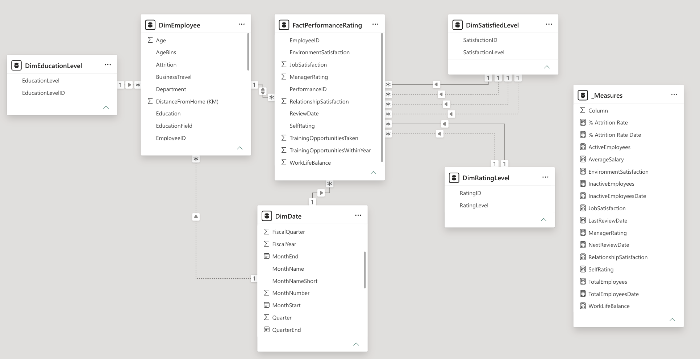

# HR Analytics Power BI Dashboard

An interactive HR Analytics dashboard built in **Power BI** to analyze employee demographics, workforce performance, and attrition at **Atlas Labs**. The project demonstrates data modeling, Power Query transformations, DAX calculations, and business intelligence dashboard design.

---

## Dashboard Preview

### Overview


### Demographics


### Performance Tracker



### Attrition



### Data Model



---

# Project Overview

The dashboard provides HR teams with interactive insights into employee hiring, demographics, performance, satisfaction, and attrition.

It was developed to transform raw HR data into business-ready dashboards that support workforce planning and data-driven decision making.

The report consists of four analytical pages:

- Overview
- Demographics
- Performance Tracker
- Attrition

---

# Dataset

The project uses the **Atlas Labs HR Analytics** dataset containing information about:

- Employee demographics
- Hiring dates
- Departments and job roles
- Performance reviews
- Satisfaction scores
- Salary
- Attrition status
- Business travel
- Overtime
- Employee tenure

---

# Tech Stack

- Power BI
- Power Query
- DAX
- Data Modeling
- Data Visualization

---

# Data Modeling

The report is built on a relational star-schema style model consisting of fact and dimension tables.

Power Query was used to clean and transform the raw HR dataset before building the analytical model.

The model includes:

- FactPerformanceRating
- DimEmployee
- DimDate
- DimEducationLevel
- DimRatingLevel
- DimSatisfiedLevel
- _Measures

The model also makes use of **inactive relationships** together with **USERELATIONSHIP()** for time-based calculations.

---

# Business Questions Answered

The dashboard answers questions such as:

- How many employees are active and inactive?
- What is the current attrition rate?
- Which departments employ the largest workforce?
- How has hiring changed over time?
- What is the age distribution of employees?
- How are employees distributed across gender, ethnicity, and marital status?
- How do employee satisfaction scores evolve over time?
- How do manager ratings compare with employee self-ratings?
- Which departments and job roles experience the highest attrition?
- How do overtime, business travel, and tenure influence employee turnover?

---

# Dashboard Pages

## 1. Overview

Provides a high-level summary of the workforce.

### KPIs

- Total Employees
- Active Employees
- Inactive Employees
- Attrition Rate

### Visualizations

- Employee Hiring Trends
- Active Employees by Department
- Active Employees by Department & Job Role

---

## 2. Demographics

Analyzes workforce composition.

### Includes

- Youngest Employee
- Oldest Employee
- Employees by Age Group
- Employees by Gender
- Employees by Marital Status
- Employees by Ethnicity
- Average Salary by Ethnicity

---

## 3. Performance Tracker

Provides employee-level performance analysis.

Users can select an employee and view:

- Hire Date
- Last Review
- Next Review

Yearly trends for:

- Job Satisfaction
- Relationship Satisfaction
- Environment Satisfaction
- Work-Life Balance
- Self Rating
- Manager Rating

---

## 4. Attrition

Analyzes employee turnover across different business dimensions.

### Includes

- Attrition Rate
- Attrition by Department & Job Role
- Attrition by Hire Date
- Attrition by Business Travel
- Attrition by Overtime
- Attrition by Tenure

---

# Key Metrics

| Metric | Value |
|---------|------:|
| Total Employees | 1,470 |
| Active Employees | 1,233 |
| Inactive Employees | 237 |
| Attrition Rate | 16.1% |

---

# DAX Concepts Used

The report includes calculated measures using:

- CALCULATE()
- DIVIDE()
- MAX()
- IF()
- USERELATIONSHIP()

Example use cases include:

- KPI calculations
- Attrition Rate
- Review Dates
- Active/Inactive employee calculations
- Time-based analysis using inactive relationships

---

# Skills Demonstrated

- Building multi-page Power BI dashboards
- Data cleaning and transformation using Power Query
- Designing relational data models
- Creating calculated measures with DAX
- Working with inactive relationships using USERELATIONSHIP()
- Developing KPI cards
- Building interactive reports using slicers and cross-filtering
- Workforce and HR analytics
- Business insight generation through visualization

---

# Repository Structure

```
hr-analytics-powerbi-dashboard/
│
├── Atlas_Labs_HR_Analytics_Report.pbix
├── Atlas_Labs_HR_Analytics_Report.pdf
├── Atlas_Labs_HR_Analytics_Semantic_Model.pbix
├── README.md
│
├── datasets/
│
└── screenshots/
    ├── overview.png
    ├── demographics.png
    ├── performance-tracker.png
    ├── attrition.png
    └── data-model.png
```

---

# Files Included

| File | Description |
|------|-------------|
| Atlas_Labs_HR_Analytics_Report.pbix | Main Power BI report |
| Atlas_Labs_HR_Analytics_Report.pdf | Exported dashboard |
| Atlas_Labs_HR_Analytics_Semantic_Model.pbix | Semantic model |
| screenshots/ | Dashboard previews |

---

# Project Outcome

This dashboard transforms raw HR data into actionable business insights that help HR managers:

- Monitor workforce health
- Track employee performance
- Identify retention risks
- Understand workforce demographics
- Support data-driven HR decision making

---

## Author

**Alnur Turgaliyev**

GitHub: https://github.com/alnurturgaliyev
