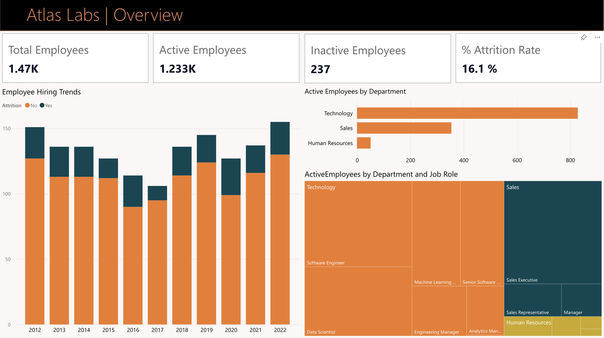
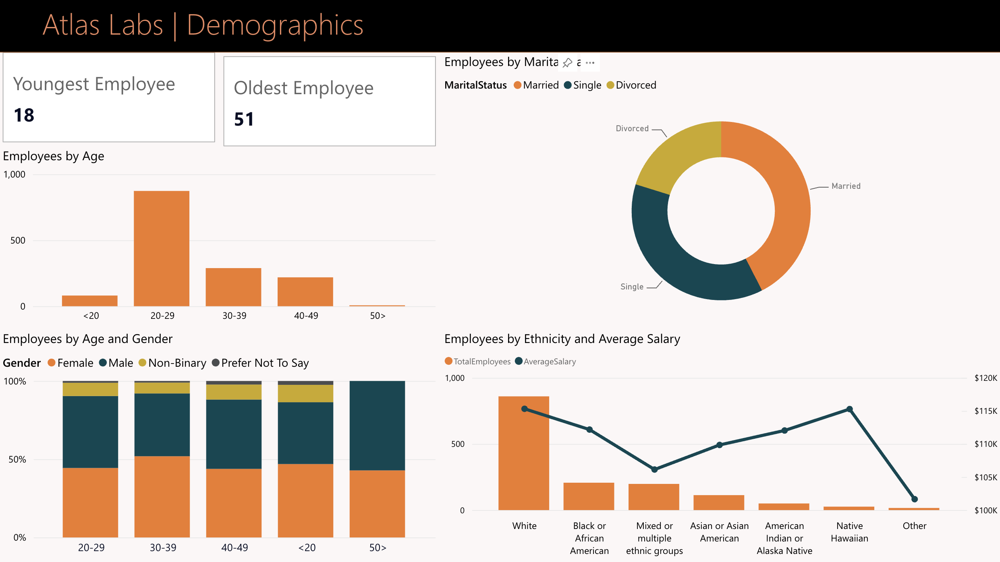

# HR Analytics Power BI Dashboard

## Project Overview

This project is an interactive **HR Analytics Dashboard** built in **Power BI** for Atlas Labs. The dashboard analyzes employee demographics, performance, and attrition trends to help HR teams understand workforce structure, identify retention risks, and monitor employee satisfaction.

The report is divided into four main pages:

- Overview
- Demographics
- Performance Tracker
- Attrition

It also includes a structured data model using fact and dimension tables.

## Dashboard Preview

### Overview

### Demographics

### Performance Tracker

### Attrition

### Data Model

## Business Questions Answered

This dashboard helps answer the following HR questions:

- How many employees are currently active and inactive?
- What is the overall employee attrition rate?
- Which departments have the highest number of active employees?
- How has employee hiring changed over time?
- Which age groups make up the largest share of employees?
- How do gender, ethnicity, and marital status vary across the workforce?
- How do employee satisfaction and performance ratings change over time?
- Which departments, job roles, and employee groups show higher attrition?
- How do overtime, travel frequency, and tenure relate to attrition?

## Key Metrics

- **Total Employees:** 1470
- **Active Employees:** 1233
- **Inactive Employees:** 237
- **Attrition Rate:** 16.1%

## Key Insights

### Workforce Overview

Atlas Labs has a total workforce of **1,470 employees**, with **1,233 active employees** and **237 inactive employees**. The overall attrition rate is **16.1%**, which gives HR a clear baseline for monitoring employee turnover.

The Technology department has the largest number of active employees, followed by Sales and Human Resources. This suggests that the company’s workforce is heavily concentrated in technical roles, making retention in the Technology department especially important.

### Hiring Trends

The hiring trend shows employee counts across multiple years, from 2012 to 2022. Hiring activity fluctuates over time, with some years showing noticeably higher employee growth. These trends can help HR understand periods of expansion and compare them with attrition patterns.

### Employee Demographics

The largest employee age group is **20-29**, showing that Atlas Labs has a relatively young workforce. The dashboard also breaks employees down by gender, marital status, ethnicity, and average salary.

The demographics page helps identify workforce diversity patterns and gives HR a better understanding of employee distribution across different population groups.

### Performance Tracking

The Performance Tracker page allows analysis at the individual employee level. It includes review dates and yearly trends for:

- Job satisfaction
- Relationship satisfaction
- Environment satisfaction
- Work-life balance
- Self-rating
- Manager rating

This view is useful for monitoring employee development, identifying changes in satisfaction, and comparing employee self-ratings with manager evaluations.

### Attrition Analysis

The Attrition page provides a deeper view of employee turnover. Attrition can be analyzed by department, job role, hire date, travel frequency, overtime requirement, and tenure.

The dashboard shows that attrition is not evenly distributed across all employee groups. Certain departments and job roles appear to contribute more to overall attrition. Factors such as overtime and business travel may also be connected to higher turnover risk.

### Tenure and Retention

Attrition by tenure shows how long employees typically stay before leaving. This can help HR identify whether turnover is more common among newer employees or longer-tenured employees.

Understanding attrition by tenure is important for improving onboarding, employee engagement, and long-term retention strategies.

## Data Model

The Power BI model uses a structured relationship design with fact and dimension tables.

Main tables include:

- `DimEmployee`
- `FactPerformanceRating`
- `DimDate`
- `DimEducationLevel`
- `DimRatingLevel`
- `DimSatisfiedLevel`
- `_Measures`

The model supports analysis across employees, dates, departments, satisfaction levels, ratings, and performance history.

## Tools Used

- Power BI
- Power Query
- DAX
- Data Modeling
- Data Visualization

## Skills Demonstrated

- Building an interactive Power BI dashboard
- Creating calculated measures with DAX
- Designing a relational data model
- Cleaning and transforming HR data
- Creating KPI cards and business-focused visuals
- Analyzing attrition and employee performance
- Presenting insights through clear dashboard pages

## Files Included

- `Atlas Labs HR Analytics Dashboard.pbix` - main Power BI report file
- `Atlas Labs HR Analytics Dashboard.pdf` - exported PDF version of the dashboard
- `screenshots/` - dashboard preview images

## Project Outcome

This dashboard provides a clear overview of employee headcount, demographics, performance, and attrition. It can help HR teams monitor workforce health, identify high-risk attrition areas, and make more informed employee retention decisions.

## Notes

This project was created as a portfolio project to demonstrate Power BI, DAX, data modeling, and HR analytics skills.
